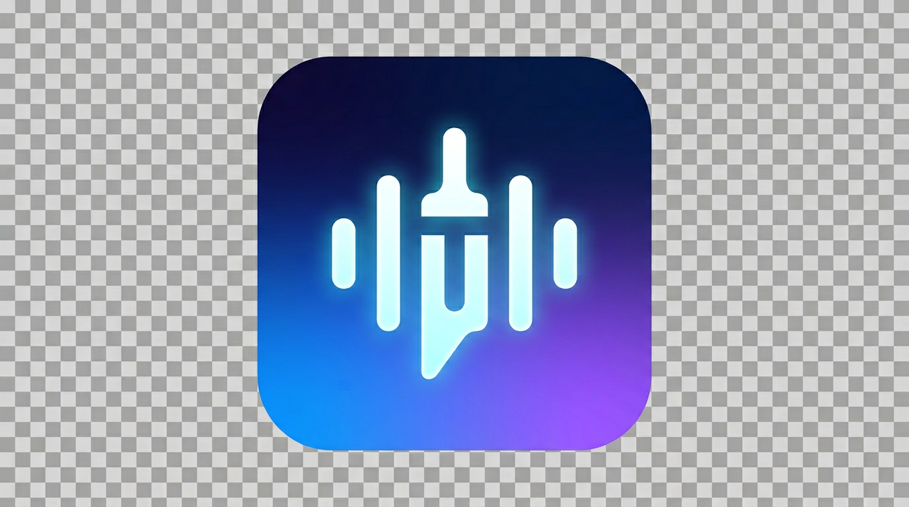

# TextSpeak Pro

**TextSpeak Pro(TM)** is a 100% offline neural text-to-speech reader for Windows, macOS and Linux. Drop in any text, pick a voice, press Play. No cloud, no API keys, no telemetry.

> TextSpeak Pro(TM) by **JojoLapin Inc.** (C) 2026 JojoLapin Inc. All rights reserved.



## Highlights

- **Completely offline** - powered by [Piper TTS](https://github.com/OHF-Voice/piper1-gpl). Your text never leaves your machine.
- **One file to run** - a single `TextSpeakPro.exe` on Windows, no installer required (installer is optional).
- **50+ voices, 30+ languages** - downloadable from the built-in catalog, with one-click install and a "Refresh from web" button.
- **Full English and French UI** - follows your OS locale automatically, with a manual override.
- **Light, Dark, and System themes** - with Windows 11 Mica backdrop and rounded corners when available.
- **Audio export** - MP3 (with ID3 tags), WAV, OGG. Batch mode splits by paragraph.
- **Portable or installed** - portable mode keeps all settings and voices next to the exe (USB-friendly).
- **Rich playback** - play / pause / resume / stop / restart, skip +/-10s, speed 0.5x to 2x, volume control, progress highlighting, auto-scroll, bookmarks.
- **Keyboard shortcuts** + **media keys** + **Bluetooth headset** controls (MediaSession API).
- **Drag-and-drop** .txt / .md / .html / .pdf / .json onto the window.
- **System tray** with "Read clipboard now" quick action.
- **Multi-language reading** in a single document by switching the voice mid-read.

## Quick start (end user)

1. Download `TextSpeakPro.exe` (or `TextSpeakPro-portable.zip` for the portable build).
2. Run it. The first-launch wizard guides you through picking a language, theme, and downloading a voice or two.
3. Paste or drop text, pick a voice, press **Play**.

## Quick start (developer)

### Windows
```
git clone <this-repo> && cd "TextSpeak Pro"
run.bat
```

### macOS / Linux
```
./run.sh
```

The launcher creates a `.venv`, installs dependencies, and starts the app.

### Manual setup
```
python -m venv .venv
.\.venv\Scripts\pip install -r requirements.txt
.\.venv\Scripts\python main.py
```

## Building and distributing

There are three ways to ship TextSpeak Pro, pick the one that fits your users.

### Option A - Portable ZIP (recommended for casual sharing)

On Windows, just double-click `build.bat`. On macOS/Linux run `./build.sh`.

The script provisions a dedicated `.venv-build`, installs `requirements.txt` + `requirements-build.txt`, runs PyInstaller against `textspeak_pro.spec`, and drops everything in `dist/`:

```
dist/
├── TextSpeakPro.exe                 <- single-file app (~150-200 MB, includes Qt + Piper)
├── TextSpeakPro.sha256              <- SHA-256 checksum for integrity verification
└── TextSpeakPro-portable.zip        <- TextSpeakPro.exe + portable.flag + empty voices/
```

Send `TextSpeakPro-portable.zip` to a friend. They unzip it, double-click the exe, and they're off. Settings and downloaded voices stay inside that folder - perfect for USB sticks or shared drives. Nothing is written to `%APPDATA%` or the registry.

### Option B - Just the .exe

Ship `dist/TextSpeakPro.exe` on its own. On first launch the app creates:

- `%APPDATA%\JojoLapin\TextSpeak Pro\` on Windows
- `~/Library/Application Support/TextSpeak Pro/` on macOS
- `$XDG_DATA_HOME/TextSpeak Pro/` on Linux

for voices, logs, cache, and settings (`settings.ini`). Users have nothing to install - no Python, no pip, no runtime. All dependencies (Qt, Chromium, Piper, onnxruntime) are bundled.

### Option C - Windows installer (Inno Setup)

For a "proper" installed experience with Start Menu shortcuts, Add/Remove Programs entry, uninstaller, and optional desktop icon:

1. Install [Inno Setup 6+](https://jrsoftware.org/isdl.php).
2. Run `build.bat` first (to produce `dist/TextSpeakPro.exe`).
3. Open `installer/TextSpeakPro.iss` in Inno Setup Compiler and click **Compile**.
4. Output: `installer/Output/TextSpeakPro-Setup-1.0.0.exe`.

### Manual build (if you prefer explicit steps)

```
python -m venv .venv-build
.\.venv-build\Scripts\pip install -r requirements.txt -r requirements-build.txt
.\.venv-build\Scripts\python build_exe.py
```

### What the build produces, in detail

| File | Size (approx.) | Purpose |
| ---- | -------------- | ------- |
| `TextSpeakPro.exe` | 150-200 MB | The whole application. Qt, Chromium (WebEngine), PySide6, Piper, onnxruntime, all Python stdlib. |
| `TextSpeakPro.sha256` | ~80 bytes | Paste into `certutil -hashfile TextSpeakPro.exe SHA256` to verify. |
| `TextSpeakPro-portable.zip` | ~140-180 MB | Unzip anywhere. Runs in portable mode thanks to the included `portable.flag`. |

### Taking it to another computer

- **Portable**: copy `TextSpeakPro-portable.zip`, unzip on the target machine, double-click. Works on any Windows 10/11 x64 machine without admin rights.
- **Installer**: copy `TextSpeakPro-Setup-1.0.0.exe`, double-click, next-next-finish.
- **Cross-platform**: build on the target OS. PyInstaller is not a cross-compiler - build Windows exes on Windows, macOS apps on macOS, Linux binaries on Linux. Same `build.sh`/`build.bat` on each.

### Size-reduction tips (optional)

The Qt + Chromium bundle is what inflates the exe. To trim it:

- Use UPX compression (set `upx=True` in `textspeak_pro.spec` and install [UPX](https://upx.github.io/)).
- Switch to a `onedir` layout (one folder instead of one file) - slower to copy but faster to start up.
- Strip unused Qt modules. `PySide6.QtWebEngineCore` alone accounts for ~80 MB; there's no way around it while using a webview.

## Data locations

| Mode        | Where your data lives                                                   |
| ----------- | ----------------------------------------------------------------------- |
| Portable    | Next to the `.exe` (triggered by `portable.flag` in the same folder)    |
| Installed   | `%APPDATA%\JojoLapin\TextSpeak Pro\` on Windows                             |
| macOS       | `~/Library/Application Support/TextSpeak Pro/`                          |
| Linux       | `$XDG_DATA_HOME/TextSpeak Pro/` (falls back to `~/.local/share/...`)    |

Voices: `<data>/voices/`  &nbsp;&middot;&nbsp;  Logs: `<data>/logs/`  &nbsp;&middot;&nbsp;  Cache: `<data>/cache/`

## Keyboard shortcuts

| Shortcut | Action |
| --- | --- |
| `Ctrl` + `Enter` | Play |
| `Ctrl` + `Shift` + `Enter` | Play from cursor |
| `Space` | Pause / resume (when editor isn't focused) |
| `Esc` | Stop / close dialogs |
| `Left` / `Right` | Skip -10s / +10s |
| `Ctrl` + `F` | Find in text |
| Media Play/Pause/Stop, Bluetooth headset controls | Full MediaSession support |

## Architecture (short version)

- **PySide6 shell** - frameless `QMainWindow` wrapping a `QWebEngineView`, with Mica backdrop on Windows 11.
- **HTML/CSS/JS UI** - glassmorphic layout, mesh-gradient background, fully i18n'd.
- **QWebChannel bridge** - direct JS <-> Python calls with signals for async work. No local HTTP server.
- **Piper TTS engine** - loaded on-demand, cached in memory; synthesis runs off the UI thread via `QThreadPool`.
- **Voice catalog** - bundled JSON + optional on-demand merge from HuggingFace `rhasspy/piper-voices`.

## Credits

- **Piper TTS** ((C) Michael Hansen / OHF-Voice community, GPL-3.0) - the neural TTS engine and voices. <https://github.com/OHF-Voice/piper1-gpl>
- **Inter** font family ((C) Rasmus Andersson, SIL OFL 1.1) - when available in the system.
- **Mutagen** (GPL-2.0) - ID3 tag writing on exported MP3 files.
- **PySide6 / Qt for Python** (LGPL-3.0) - GUI toolkit.

## License

This project's own source code is released under the MIT License (see `LICENSE`). Note that the bundled/used Piper TTS engine is GPL-3.0; building a redistribution that statically embeds Piper will fall under GPL-3.0 as well. See `NOTICE` for detailed attribution.

**TextSpeak Pro(TM)** is a trademark of JojoLapin Inc.

(C) 2026 JojoLapin Inc. All rights reserved.
